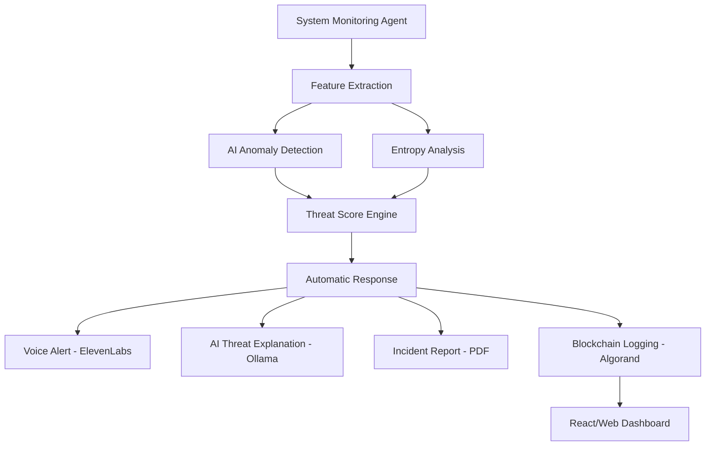

# RANZR: AI-Powered Behavioral Ransomware Detection & Autonomous Response System

## Project Overview
RANZR is a real-time, behavior-based ransomware detection and autonomous containment system. Unlike traditional signature-based antivirus solutions, RANZR leverages AI anomaly detection, file entropy analysis, and a structured threat scoring engine to identify zero-day and polymorphic ransomware threats in real-time.

When suspicious activity is detected, RANZR initiates an autonomous response that includes:
- Automated process termination
- AI-generated root cause explanation (powered by Ollama)
- Real-time voice alerts (powered by ElevenLabs)
- Forensic PDF report generation
- Tamper-proof evidence logging formatted for the Algorand blockchain

## System Architecture


---

## 👥 Teammate Instructions & Responsibilities

This repository primarily contains the **Core AI & Intelligence Engine** (built by Tanuj). For other teammates working on the project, here is how your components integrate:

### 1. 🖥️ UI / Frontend Team
Your goal is to build the dashboard that visualizes the telemetry and responses.
- **Integration Point**: The AI engine will output forensic JSON/PDF data and trigger webhooks.
- **Task**: 
  - Build a real-time dashboard (e.g., in React, Next.js, or Vue).
  - Consume the JSON outputs from the Threat Scoring Engine.
  - Display the generated `incident_report.pdf`.
  - Present the "AI Explanation" (Ollama output) to the end user in a readable format.

### 2. 🔗 Blockchain Team (Algorand)
Your goal is to ensure tamper-proof logging of the incident evidence.
- **Integration Point**: Check out the `blockchain/` directory in this repo, specifically `prepare_data.py`. The AI engine extracts forensics and formats them as a JSON payload.
- **Task**: 
  - Write Algorand Smart Contracts / PyTeal or use the Algorand SDK.
  - Take the JSON payload generated by `prepare_data.py` and submit it as a transaction to the Algorand testnet/mainnet.
  - Return the transaction ID hash to the central dashboard for verification.

### 3. 🛡️ System Monitoring Team (Agents/Sensors)
Your goal is to capture live system metrics and feed them into the AI engine.
- **Integration Point**: Check out `detection/feature_extraction.py`.
- **Task**: 
  - Build a lightweight daemon/agent (e.g., using Rust/C++ or Go) that continuously gathers system metrics (CPU usage, IOPS, file modification rates, entropy changes).
  - Send this live telemetry data stream to the Python AI Engine for inference.

---

## Setup & Installation

### Prerequisites
- **Python 3.8+**
- **Ollama**: Must be installed locally and running for the private AI Explanations.
  - Run `ollama serve` and ensure you have pulled a model like Llama-3: `ollama run llama3`

### 1. Clone the repository
```bash
git clone git@github.com:k-tanuj/RANZR.git
cd RANZR
```

### 2. Create a Virtual Environment (Recommended)
```bash
python -m venv venv
source venv/bin/activate  # On Windows: venv\Scripts\activate
```

### 3. Install Requirements
```bash
pip install -r requirements.txt
```
*(Dependencies: `numpy`, `scipy`, `scikit-learn`, `psutil`, `reportlab`, `pyyaml`, `requests`, `pytest`)*

### 4. Configuration
1. Copy the example configuration file:
   ```bash
   cp config/settings.example.yaml config/settings.yaml
   ```
2. Open `config/settings.yaml` and add your **ElevenLabs API Key** for voice generation:
   ```yaml
   elevenlabs_api_key: "YOUR_REAL_API_KEY_HERE"
   ```

---

## Running the Pipeline

To execute the end-to-end AI detection and response pipeline simulation, run:
```bash
python main_ai_pipeline.py
```
*This will simulate a ransomware attack, calculate entropy/anomalies, generate a threat score, terminate processes, speak an alert, and generate a blockchain-ready PDF incident report.*

## Running Tests

To run the unit test suite and verify everything is working correctly:
```bash
pytest tests/
```

## Project Directory Structure

- `detection/`: Core feature extraction, entropy analysis, threat scoring, and response mechanism.
- `ai_engine/`: Isolation Forest model definitions and inference.
- `reporting/`: AI explanation via Ollama, voice alerts via ElevenLabs, and PDF report generation (ReportLab).
- `blockchain/`: Data formatting, cleaning, and hashing for Algorand smart contracts.
- `config/`: Centralized settings (thresholds, weights, API keys).
- `tests/`: Extensive unit tests for all components.
